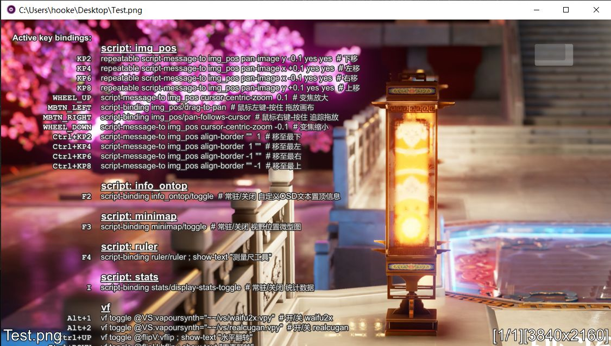

# 简介

mpv-MIV

此分支仅演示将mpv作为图片查看器的特定配置

## Minimalist Image Viewer

mpv的一种衍生用法，最早只是我个人用来预览waifu2x的输出效果；  
而由于mpv的部分良好特性似乎也被很多人用来当作图片查看器，于是合并两类用途就有了此分支。

_该仓库没有细致的注释，默认你已基本熟悉mpv的使用。也不提供完整的成品包，只是一个作为有此类需求的样本参考。_

>**Note**  
> mpv-lazy 懒人包的用户，可以快速将其转换为 mpv-MIV ：  
>使用对应的版本（查看commit的信息），移除原标准包（+自选增强包）的 `portable_config` 目录中的除 `shaders` 文件夹外的所有文件，再将此分支的 `portable_config` 覆盖，即可完成部署。

P.S.  
mpv有下列缺陷（相较于常规的图片浏览器）因此只能作为一个玩具型的图片查看器 ——
- 无增量加载且限制图像的加载体积（受限于显卡纹理）
- 无预读
- 无法一次性显示多张图片
- 处理非常大的图像很弱
- 不启用icc修正时会忽略图片的内嵌icc
- 部分处理只应用于YUV→RGB的矩阵转换过程中

参考：  
[image.lua](https://gist.github.com/haasn/7919afd765e308fa91cbe19a64631d0f)  
[mpv-image-viewer](https://github.com/occivink/mpv-image-viewer)
